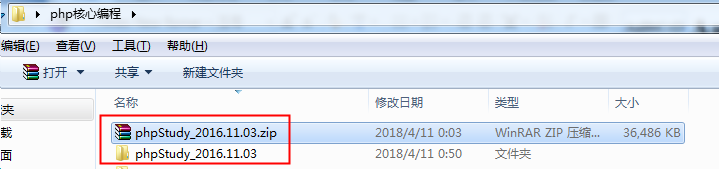
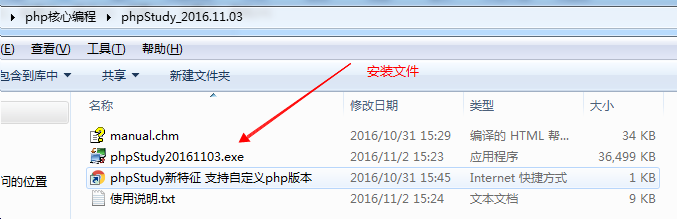
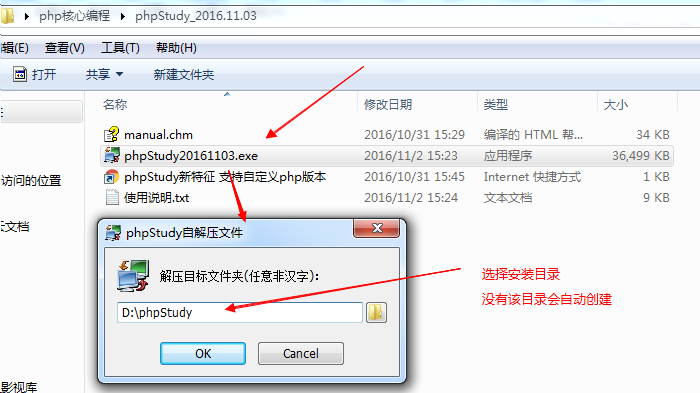
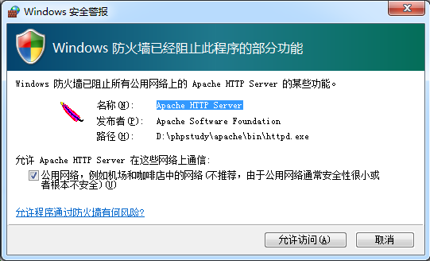
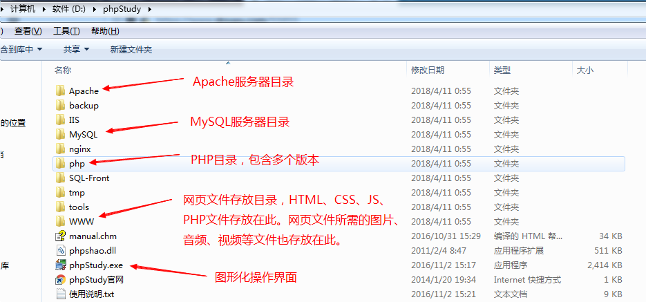
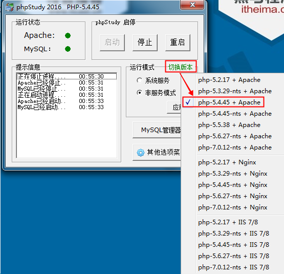
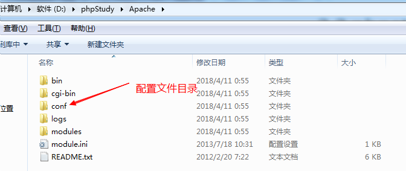
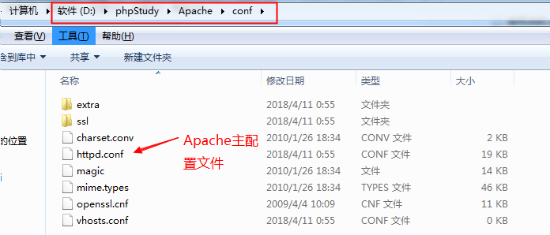
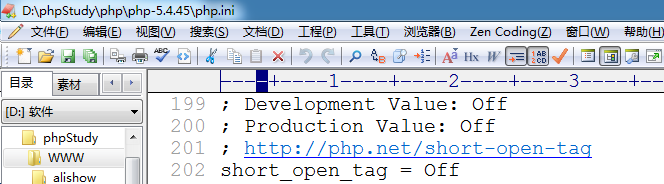
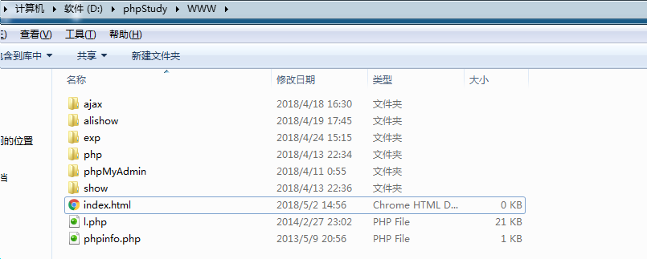

# 安装环境 （phpstudy）

>  phpstudy是一个集成环境，集成了Apache（IIS和nginx）、PHP、MySQL。 安装该软件后，PHP开发的程序就能运行了。

## 准备工作

解压phpstudy包

解压后:

## 安装

双击安装文件即开始安装

   特别注意: **phpstudy**的安装路径中**不允许出现中文**，今后安装所有开发相关的软件时也都安装在英文路径下
    

此处选择“是”

(也许会在这之前弹出一个空白的网页，不要管他，关闭就会出现下面的情况)

设置防火墙允许访问， **Apache和MySQL**都要允许

开启Apache和MySQL服务： **绿色圆圈表示启动， 红色方块表示停止**

打开浏览器输入

测试:  开启任意浏览器，输入下列地址

  127.0.0.1  、  127.0.0.1:80

  localhost  、  localhost:80

看到上图说明已经安装成功

## phpstudy目录结构

phpstudy集成了 Apache、IIS、nginx三种最常见的web服务器软件和多个版本的PHP，并且通过图形化控制面板（phpstudy.exe）可以自由切换

切换服务器和php版本：  默认使用的是  **Apache + php-5.4.45**

## Apache目录结构

配置文件中带 # 的都是注释项，不带的是有效的配置项

主要配置项：

重点:

  **Listen: 如果报80端口被占用可以修改为其他值，例如：8088**

DocumentRoot: 配置html、css、js、php等文件保存的路径。

浏览器中输入localhost或者127.0.0.1，系统就会去DocumentRoot指定的目录去寻找对应的文件。

DirectoryIndex:  默认访问文件配置

localhost =>  localhost/index.html

localhost : 首先在www目录下找 index.html；如果没有index.html，找index.php；如果没有Index.php找index.htm；没有则找 l.php。  如果连 l.php都没有，则会将 www 目录下的所有文件和文件夹以列表形式显示出来

## PHP目录结构

php.ini: php配置文件。  进入到 php-5.4.45目录

带 ； 是注释，不带的是有效配置项

### WWW目录

我们今后编写的所有网页文件（html、css、js、php）和网页所需要的资源文件（图片、音频、视频） 都需要保存在该目录下。

当我们通过浏览器访问任意页面时，都需要在浏览器的url地址栏输入类似地址来进行访问，不论是php文件还是html文件。

例如：

localhost/index.html       localhost/admin/showlist.php

localhost会找  d:/phpstudy/www 目录下的文件