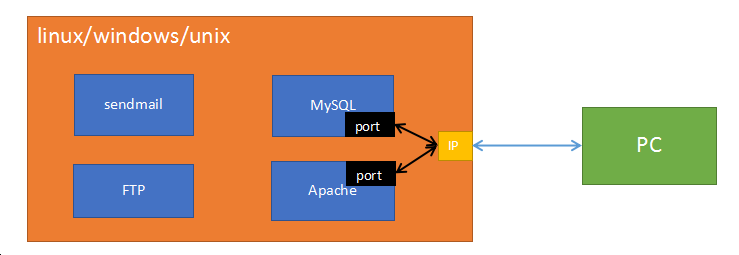

# 初识PHP

## 第一个程序 --- Hello World

1) 在WWW目录下创建如下目录结构： php1/code/

2) 在code目录下创建  hello.php 文件

3) 使用sublime（或其他编辑器）打开hello.php，编写如下代码

4) 访问测试 

     在浏览器中输入：localhost/php1/code/hello.php


##  程序解析


1) **php文件不能使用中文进行命名， 浏览器地址栏不允许出现中文**———在实际开发中摒弃中文

2) **在浏览器中查看任何文件（不管是html还是php）都必须使用localhost**

3) PHP程序可以和HTML进行混编，可以写在HTML中的任何位置，head、body，任何标签，任何属性均可

4) php语言的标记
```php
 <?php  php代码  ?>   标准标记
 <?     php代码  ?>   短标记（需要修改php.ini文件打开）
```

5) 指令分隔符：**必须使用**（不然会报错）
```php
 PHP语句使用 ‘;’  结束     
```

6) echo相当于js的 document.write 能够在页面上输出内容，包括输出标签、css样式代码等

7) php文件中可以编写html、css、js代码，但是html文件中不能编写php代码。也就是说**后缀是php的文件才能编写php代码**


## URL解析

### URL地址说明

URL: uniform resource locator  统一资源定位器

       localhost  <==>  http://localhost:80/index.html （全URL）

- http: 超文本传输协议
- localhost: 域名。（一般域名：www.taobao.com，www.sina.com.cn） localhost是特殊域名，每一台电脑都有，并且指向当前使用的电脑
- 80: 端口号。 apache的默认端口号为80，所以可以省略不写  (tips:很多web服务器默认端口都是80 Nginx IIS)
- index.html: 访问的文件的路径 (localhost指向了 d:/phpstudy/WWW)，所以该url地址访问的是  d:/phpstudy/WWW/index.html文件
- 如果没有指定访问的文件，则默认会访问index.html文件；如果没有index.html文件，则会以列表形式显示当前目录下的所有文件夹和文件
  localhost:  D:\phpStudy\WWW

### IP

IP: Internet Protocol  互联网协议，是为计算机网络相互连接进行通信而设计的协议。

    处于网络（互联网、局域网）上的任何一台计算机都有一个独立的ip地址。
```
ip地址由4段3位长度的数字组成， 3位数字的取值范围 0-255。如： 102.15.201.10
```

特殊ip:
```
127.0.0.1 : 回环地址，每一台电脑都有该ip，指向当前使用的电脑
192.168.**.* *: 该网段是专门用于做==局域网==的ip段。
```

### 域名

域名（Domain Name）： 每个网站都有一个自己的域名。人们可以在浏览器中输入域名来访问对应的网站。

    淘宝: www.taobao.com

    百度: www.baidu.com


特殊域名：
```
   localhost: 本地主机。在浏览器中输入localhost就会访问当前操作的这台电脑的web服务器。
```

###  DNS

  DNS: Domain Name System  域名系统。在DNS服务器中保存了域名和IP的映射关系。主要工作是将域名转换为IP地址，因为我们通过浏览器访问网站时，实际上是去找对应的IP地址。

   域名: 网站的名称，就相当于人名。

   IP: 网站在网络上的实际地址，就相当于人的住址。

      一般访问网站时都是输入域名的(例如： www.tmall.com  www.163.com)，但是在实际访问时域名会被DNS转换为IP地址。

   DNS工作机制图:
   

hosts文件可以手动设置域名和IP的映射关系

dns缓存可以保存曾经访问过的域名和IP的映射关系


工作步骤:

1)  在浏览器中输入  www.taobao.com，按下回车

2)  浏览器首先在本机中的 hosts文件和dns缓存中查询，www.taobao.com的IP地址。如果有，则获取该IP地址，然后去访问淘宝服务器。 如果没有，则向dns服务器发送解析请求。

3) dns服务器获取到浏览器请求信息之后， 将域名转换为IP地址，再将IP地址返回给浏览器。

4) 浏览器获取到IP地址，然后通过IP地址访问淘宝服务器。 


 windows下查看dns缓存:

 ```
  windows下查看dns缓存:
 ```

思考：IP地址和域名是不是一一对应的？

  有域名没有IP； 有IP没有域名；一个IP可以对应多个域名。


### 端口

 端口是英文port的意译。端口可以理解为区分服务器上服务的标号。

   已被占用的著名端口号：

```
80:   Web端口号， Apache、Nginx、IIS
21:   FTP端口号， FTP软件
22:   SSH端口号
25:   sendmail端口号
......
```

因为Web服务的默认端口号是80，所以在地址栏可以不输入，但是如果将端口号改为其他的（如：8088），那就必须输入端口号，才能正常访问。

