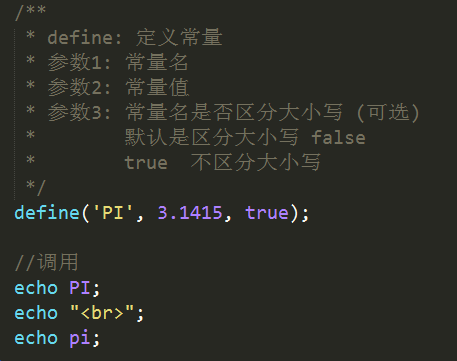
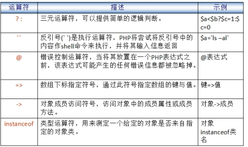

# 变量

变量命名规则：

- 由字母、数字、下划线组成，必须以字母或者下划线起头
- 变量的长度可以是任意的，但不能超过255个字符
- 最前面需要加 $
- 变量名最好有意义，能够做到见名知意
- 当变量名由多单词组成时，最好使用下划线分割或者使用驼峰命名法
- PHP变量区分大小写

```php
        <?php 
        // 正确的变量名
        $int = 123;
        $str = 'abc';
        $str1 = "def";

        // 变量名区分大小写
        $INT = 234;

        echo $int;
        echo $INT;

        // 推荐的变量名
        $goods_name = "华为 保时捷";
        $goodsPrice = 10888;

        $a = 'big';
        $big = 123;
        echo $$a;  //可变变量  echo $big
        ?>
```

思考：
以下变量名哪些是正确的：

```php
    $a、  $var、  $_123、  $1b、  $b1c2、  $_#abc  
```


## 双引号和单引号的区别


**双引号中的变量会被解释为值**

**单引号中的变量会被解释为字符串**

  单引号的执行速度会快于双引号的速度


##  常量


保存不会发生改变的数据(如：3.1415， 路径等)时，最好使用常量。

 常量的使用方法：

   1) 声明:  define(常量名,  常量值,  大小写区分标志);   

	true（不区分）/false（区分/默认）;

   2) 调用:  echo  常量名;

   


##  运算符


### 运算符种类

- 算术运算符
- 字符串运算符
- 赋值运算符
- 比较运算符
- 逻辑运算符
- 其他运算符

算术运算符：


特殊案例:
```php
    $str = "abc";
    $int = 20;
    echo $str + $int;   //20

    $str = "5";
    $int = 20;
    echo $str + $int;   //25
```

赋值运算符：


`$a += $b   $a = $a + $b`

比较运算符：

 

逻辑运算符：


异或: (了解)
```
    true   xor   true   =  false
    true   xor   false  =  true
    false  xor   true   =  true
    false  xor   false  =  false
```

其他运算符：



三元运算符: 判断表达式？值1：值2

php默认内置有4种错误： 

```
    notice：         通知错误
    Warning error：  警告错误
    Parse error：    解析错误
    Fatal error：    致命错误 
```
@不能屏蔽掉所有的错误。 也不建议在实际开发中使用该符号
```php
        <?php 
        // 语法错误是不能被屏蔽掉的
        @$books = "JavaScript"
        echo $books;

        // 大多数其他错误是可以被屏蔽掉的
        @abc();
        ?>
```


##  字符串链接运算符

- 字符串拼接:  （ . ）  

        在php中字符串拼接:   .  

        与js中的 + 号 拼接符使用方式一致
   
   在php中  + 号 是运算符。

