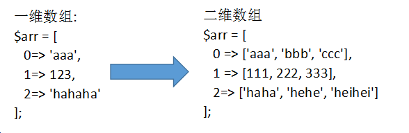
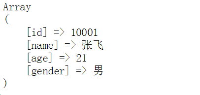

# 数组

 ```javascript
    var  arr = [123, 'abc', 234];   
    console.log(arr[1]); 
```
   PHP的数组分为索引数组和关联数组两类:

```php
 索引数组: **下标是数字**的数组就是索引数组
 关联数组: **下标是字符串**的数组就是关联数组 (重点)
```

格式：

```php
    $arr = array();
    $arr = [];
```
```php
    //声明索引数组
    //               0         1         2
    $arr1 = array('福禄娃', '海绵宝宝', '猪猪侠');
    $arr2 = array(3=>'蜘蛛侠', 6=>'钢铁侠', 10=>'煎饼侠');
    $arr3 = ['张无忌', '赵敏', '灭绝师太'];

    //声明关联数组 -- 下标是字符串
    $info = ['name'=>'张二狗', 'age'=>20, 'gender'=>'男'];
    $goods_info = ['goods_name'=>'小米 8', 'goods_price'=>1999];
```

## 数组读写

   不管是索引还是关联数组，都是通过下标来进行读写控制的。
```php
    echo $arr2[6];
    //下标是字符串，一定要加引号
    // 如果不加引号就会变为常量
    echo $info['name'];

    $goods_info['goods_name'] = '小米 note 3';
```

## 数组遍历

foreach 语句结构，用来遍历数组(关联数组和索引数组均可)。

格式: 

```php
    foreach($arr as $key=>$value){程序体}

    foreach($arr as $value){程序体}
```

$arr : 要遍历的数组   

```php
    $key: 单元的下标，可以是任意变量名
    $value: 单元的值，可以是任意变量名
```
```php
    <?php 
    $arr = ['张无忌', '赵敏', '灭绝师太'];

    //第一次循环，将第一个单元取出
    //将单元的下标，赋值给$key
    //将单元的值， 赋值给$value
    //第二次循环，将第二个单元取出，赋值步骤同上
    foreach ($arr as $key=>$value) {
        echo $key . "-" . $value . '<br>';
    }


    $goods_info = ['goods_name'=>'小米 8', 'goods_price'=>1999];
    foreach ($goods_info as $k=>$v) {
        echo $k . '-' . $v . '<br>';
    }

    //如果as后面只有一个变量，该变量就是数组的单元值
    foreach ($goods_info as $value) {
        echo $value;
    }
    ?>
```

## 二维数组和多维数组

- 一维数组的单元中，保存了一个数组，那么该数组就是二维数组
- 二维数组可以想象成一个表格
- 二维数组同样也用下标来进行控制
- 二维数组常用来存储一组相似/相关的数据
- 二维数组的每个单元都保存一个一维数组，就是三维数组；三维数组的每个单元都保存一个数组就是四维数组； 依次类推，可以到n维。在一般开发中，最常用的是一维和二维数组，三维极少使用。
 

```php
    //同质数据
    $list = [
    0=>['name'=>'zs', 'age'=>20, 'gender'=>'男'],
    1=>['name'=>'ls', 'age'=>21, 'gender'=>'女'],
    2=>['name'=>'ww', 'age'=>19, 'gender'=>'女'],
    ];
```

## 遍历二维数组

     核心思想： 使用foreach取出第一维的数据（数组），第二层通过下标输出
```php
    $list = [
    0=>['id'=>1, 'name'=>'zs', 'age'=>20, 'gender'=>'男'],
    1=>['id'=>2, 'name'=>'ls', 'age'=>21, 'gender'=>'女'],
    2=>['id'=>3, 'name'=>'ww', 'age'=>19, 'gender'=>'女'],
    ];

    //通常在实际开发当中，都只用一层foreach;
    //第二层数据的显示，使用$value[下标]
    //$value是一位数组
    //第一次循环: $value = ['id'=>1, 'name'=>'zs', 'age'=>20, 'gender'=>'男'];
    //第二次循环: $value = ['id'=>2, 'name'=>'ls', 'age'=>21, 'gender'=>'女'];
    //第三次循环: $value = ['id'=>3, 'name'=>'ww', 'age'=>19, 'gender'=>'女']
    foreach ($list as $key=>$value) {
        echo $value['id'] . ' ';
        echo $value['name']. ' ';
        echo $value['age']. ' ';
        echo $value['gender'];
        echo "<br>";
    }
```

## 将数组输出成一个表格

方式一 : 使用echo来输出整体的表格结构，再用foreach来循环输出tbody中的结构和数据
```php
    $list = [
    0=>['id'=>1, 'name'=>'zs', 'age'=>20, 'gender'=>'男'],
    1=>['id'=>2, 'name'=>'ls', 'age'=>21, 'gender'=>'女'],
    2=>['id'=>3, 'name'=>'ww', 'age'=>19, 'gender'=>'女'],
    ];

    echo "<table border='1' width='600'>";
    echo "<thead>";
    echo "<tr>";
    echo "<th>编号</th><th>姓名</th><th>年龄</th><th>性别</th>";
    echo "</tr>";
    echo "</thead>";
    echo "<tbody>";
    //以第一次循环为例
    //$value = ['id'=>1, 'name'=>'zs', 'age'=>20, 'gender'=>'男'];
    foreach ($list as $value) {
        echo "<tr>";
        echo "<td>".$value['id']."</td>";
        echo "<td>".$value['name']."</td>";
        echo "<td>".$value['age']."</td>";
        echo "<td>".$value['gender']."</td>";
        echo "</tr>";
    }
    echo "</tbody>";
    echo "</table>";
```

方式二: 提前定义好表格结果，只循环tbody中的内容

```php
    <?php 
    //同质数据
    $list = [
    0=>['id'=>1, 'name'=>'zs', 'age'=>20, 'gender'=>'男'],
    1=>['id'=>2, 'name'=>'ls', 'age'=>21, 'gender'=>'女'],
    2=>['id'=>3, 'name'=>'ww', 'age'=>19, 'gender'=>'女'],
    ];
    ?>
    <table border="1" width="600" class="a">
        <thead class="b" style="color:red">
            <tr>
                <th>编号</th>
                <th>姓名</th>
                <th>年龄</th>
                <th>性别</th>
            </tr>
        </thead>
        <tbody>
            <?php foreach ($list as $value) { ?>
            <tr>
                <td><?php echo $value['id']; ?></td>
                <td><?php echo $value['name']; ?></td>
                <td><?php echo $value['age']; ?></td>
                <td><?php echo $value['gender']; ?></td>
            </tr>
            <?php } ?>
        </tbody>
    </table>
```


## print_r函数

   该函数不但能够输出基本类型，还能够输出数组，在项目开发时经常使用该函数查看数组中的所有数据。

   debug的核心思想就是跟踪变量，一段程序中所有变量中保存的是自己需要的数据，程序才在自己的掌控之下。

```php
    $info = ['id'=>10001, 'name'=>'张飞', 'age'=>21, 'gender'=>'男'];
    print_r($info);
```



```php
    $list = [
    0=>['id'=>1, 'name'=>'zs', 'age'=>20, 'gender'=>'男'],
    1=>['id'=>2, 'name'=>'ls', 'age'=>21, 'gender'=>'女'],
    2=>['id'=>3, 'name'=>'ww', 'age'=>19, 'gender'=>'女'],
    ];
    print_r($list);
```


使用 echo  来输出数组，则会得到以下错误


