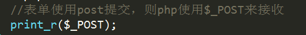
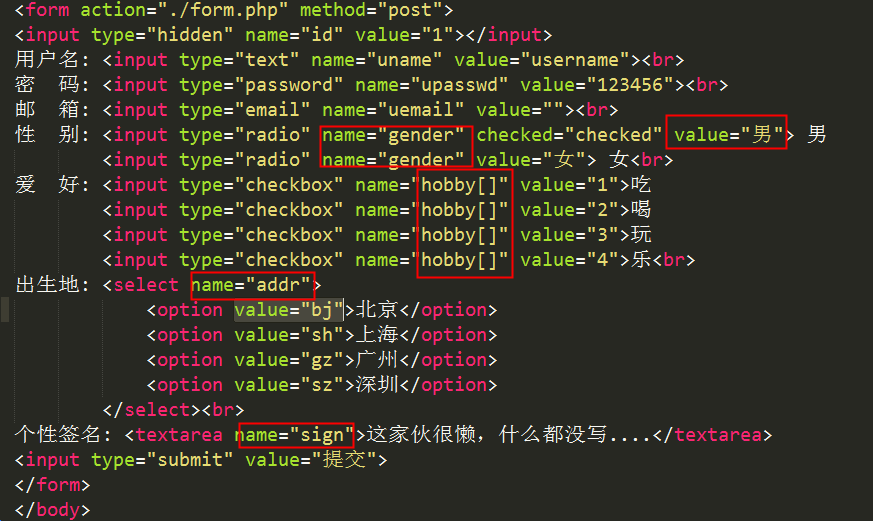
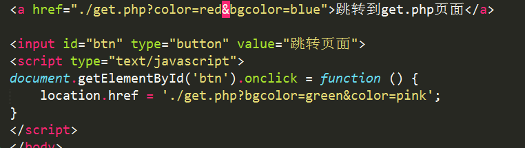

# 超全局变量(预定义数组)

## 什么是超全局变量

    超全局变量是PHP内置的变量，在每一个php文件中都可以直接使用。

    特点: 
    在每个页面都能直接使用
    内部都是**关联数组**结构

>非常重要: $_GET、$_POST、$_SESSION、$_COOKIE、$_FILES
知道: $_SERVER、$_REQUEST、$GLOBALS

## $_SERVER

$_SERVER记录了服务器和客户端的主要信息，和当前页面的信息

重点记住的内容:

  REQURES_URI ： 访问的文件地址

  SCRIPT_NAME： 脚本名称（路径）

  PHP_SELF： 自身文件名

  访问的文件的绝对路径。 此处的绝对路径是和域名绝对

   /php2/code/server.php -->  localhost/php2/code/server.php

## get/post方式接收表单数据

    表单处理通常需要两个页面：

      1)  form.html，表单页，用户可以在表单页上填写相关数据

      2)  form.php ,  数据接收处理页， 接收用户在表单填写的数据，然后做进一步处理

代码实现：

form.html

form.php

注意:  表单中每个域的name值，会作为$_POST的下标

表单提交关键点总结:

  表单页: form.html

    1) 必须有form表单标签，form必须有action 和 method 两个属性

- action: 指定表单数据提交的位置 ---  php/jsp/asp文件的路径
- method: 表单提交的方式， post 、get(默认)

    2) 每个表单域都要有name属性    input   select   textarea

    3) 必须有submit类型的按钮

   

   数据接收处理页： form.php

    1) method=post时，使用$_POST接收数据    

    2) method=get时，使用$_GET接收数据

    3) 不管是$_POST还是$_GET，都是一个关联数组，数组的下标就是表单域中 name 属性的值

## 每种域和类型的提交方式

 表单标签： form 、 **input 、 select 、 textarea**

  **表单提交的实际上是每个域的value值**

  1) input  type= text/password/hidden/email  提交的就是value属性中的值

  2) input  type=radio  提交的是选中项的value值。**value必须设置，否则后端会接收 on**

  3) input  type=checkbox  **在name的值后增加[] 转换成数组结构**，后端才能接收到所有的已勾选项

  4) select  name值需要定义在select标签中； value定义在option中，每条option都有自己的value

                 如果不定义option中的value，则会将option中间的内容发送到后端页面中

  5) textarea  name值定义在textarea标签中，value没有显式的表示出来，就是开始标签和结束标签之间的内容

#  post和get的区别 (非常重要)

## 通过URL地址栏来区分post和get

get将提交数据拼接成字符串显示在URL地址栏中

post不显示

1) 提交方式

- get会将数据显式的拼接到url地址栏中  (字符串)
  例如： form.php?id=10001&username=heiheihei&passwd=123456&key=value....
  key=value方式传参，多个参数之间使用&符号隔开

         id、username、passwd等等（键/key）都是表单域的name值

         1、heiheihei、123456等等（值/value）都是表单域的value值

- post不会显示出来

2) 传递数据量大小

- post最小值是2M，默认8M，可以通过修改php配置(php.ini)文件来修改大小，理论上没有上限的。
- get会受到浏览器的地址栏的限制。有的是2k，有的是8K(chrome)

3) 应用范围不一样

- post在绝大多数情况下都使用在表单提交中。
- get的应用范围比较广。在a标签的href中，location.href中等都能使用get方式。

## $_REQUEST

   $_REQUEST 即可以接收get方式提交的表单，也能接收post方式提交的表单。但是因为速度比较慢，所以现在被弃用。

 

