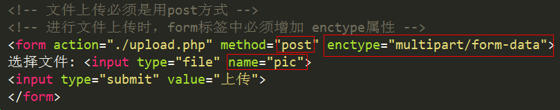

# 文件上传

 文件上传属于一种特殊的表单提交，也需要两个页面 ---  表单页  和   数据处理页。

upload.html表单页

upload.php 上传文件处理页

文件上传核心点总结:

## 核心点一：表单设计

	表单标签form中必须额外增加 enctype属性，必须使用post提交表单

	文件域必须有name属性和值

## 核心点二  ---  $_FILES

$_FILES是一个二维数组，保存了上传文件的相关信息：

 第一维下标是 文件域的name值

 第二维有5个固定单元

   name: 上传的文件名

   type: 上传的文件类型

   tmp_name: 上传文件在服务器临时存储的路径

   error:  错误码，错误码有0-4  5个值。 等于0时，代表文件正常上传

      0：代表正常上传，没有错误

      1：代表上传文件大小超过了 php.ini中 upload_max_filesize 定义的大小

      2：代表上传文件大小超过了 php.ini中 post_max_size 定义的表单最大值

      3：文件只有部分被上传 

      4：没有文件被上传 

   size: 上传文件的大小  bit

## 核心点三  ---  move_uploaded_file**

从$_FILES中我们可以知道，文件已经正常上传到服务器了。

所以，接下来就需要将文件从临时保存路径，移动到我们希望保存的路径中。

move_uploaded_file (参数1， 参数2)；

 参数1: 临时路径  --->  $_FILES['pic']['tmp_name']

 参数2: 目标路径  --->  使用相对路径移动到当前目录下   ./ 

