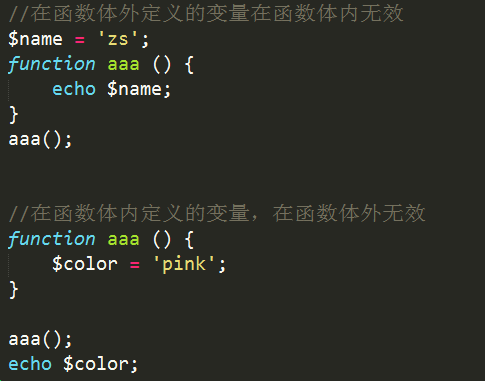

# 函数 

## 什么是函数

函数(function) 是一段完成指定任务的已经命名的代码块。

PHP函数包括内置函数（系统函数）和自定义函数两类

## 函数的格式

PHP声明函数的方式和Javascript一致。
```php
    function  函数名称（[参数1 [,参数2 [,…]]]）
    {
        函数体;
        
        //如需函数有返回值时使用
        [return 返回值;]
    } 
``` 


## 变量的作用域


 核心概念: 在函数体外定义的变量，在函数体内无效

 	  	   在函数体内定义的变量，在函数体外无效



- 全局变量 和 局部变量:
    - 局部变量:  函数体内的变量，该变量只在函数范围内有效。
    - 全局变量:  函数体外的变量，在整个php文件中都有效（除了函数）。


## 文件包含


文件包含一共有4个函数:   include、include_once、require、require_once

  **文件A中包含文件B，那么文件B就相当于文件A的一部分。**

  注意事项: 
```php
    如果文件A和文件B定义了相同的变量，则会发生覆盖。
    如果文件A和文件B定义了相同的函数，则会发生致命错误。
```

    include        require

    include_once   require_once


四个语句的区别：

1) include在包含一个不存在的文件时，会产生一个Warning错误，程序不会中断继续执行；而require会产生Fatal错误，中断执行。

2) include_once和require_once的区别：include_once只会加载一次相同的文件，而inlcude会加载多次。

3) 在实际开发中基本使用 include_once或者require_once


## static静态变量


   当一个变量使用static进行修饰时，该变量在整个php页面运行过程中只有一份。

  

      每次调用 aaa() 函数时，都会去静态内存区寻找是否有 $i。如果没有，则创建$i并进行赋值；如果有，则直接使用，跳过赋值过程。

    static在递归操作中非常有用。


## global全局变量


 如果在一个函数体内想强行使用函数体外定义的变量，可以使用global关键词来声明。

 

    $GLOBALS的功能和global差不多，都不推荐使用。