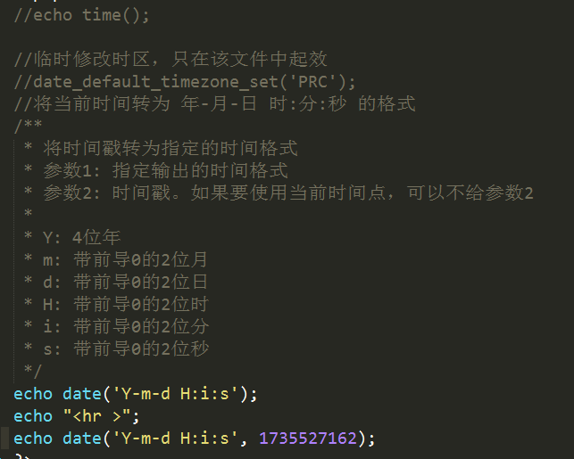

# 常用函数

## 日期函数

```php
    int time():  获取当前时间点的时间戳 -- 1970.1.1 00:00:00 到现在的秒数
    string date(format $str, timestamp $int): 可以将时间戳转为年月日时分秒的形式
```
```php
    date函数说明：

    参数1: 要显示的时间格式
    参数2: 时间戳, 可选参数, 如果不指定则为当前时间戳
    返回值: 指定的时间格式

    时间格式参数:
    Y: 4位年
    m: 带前导0的2位月
    d: 带前导0的2位日
    H: 带前导0的2位时
    i: 带前导0的2位分
    s: 带前导0的2位秒

    修改时区有两种方法:
    1)  使用函数 ---- date_default_timezone_set();      临时修改
    2)  修改php配置文件 php.ini                         永久修改
    北京时间: PRC (中国人民共和国)  或者  asia/shanghai (亚洲/上海)
```


在php.ini文件中永久修改时区的配置项


重启apache服务器，才能使最新的配置项生效。 （只要修改过Apache或者php的配置文件，就都需要重启Apache服务器才能生效。Apache配置文件 httpd.conf）




## 变量函数

```php
    bool empty($var): 判断变量是否为空。如果为空返回 true；反之，则返回false
    bool isset($var): 判断一个变量是否被设置。 如果已设置返回true，反之，返回false
    void unset($var): 删除变量，无返回值
```


## 数组函数

```php
    bool in_array(mixed, arr):  检查一个值是否存在于一个数组当中
    array explode(delimiter, str): 使用一个字符串将另一个字符串分割为数组
    string implode(str, arr):  使用一个字符串将一个数组链接为字符串
```

## 字符串函数

```php
    int strlen(str):  获取字符串长度
    int strpos/strrpos($str, $char): 查询$char字符串在$str字符串中的第一次/最后一次出现的下标
    string substr（str, start[, length]）:  字符串截取
    string str_replace（search, replace, str）:  字符串替换
    string trim（str）:  删除字符串左右两边的空格
    void die/exit([str]): 结束当前脚本
```