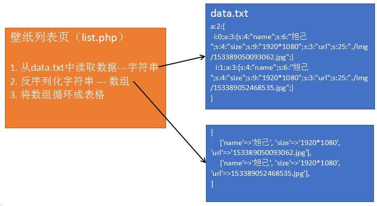
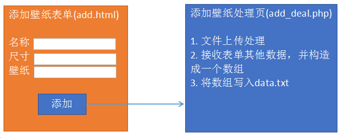

# 文件读写

##  读取文件内容

```php
    string  file_get_contents(string $file);
    参数: 文件路径，可以是本地文件的路径，也可以是网络地址
    返回值: 文件内容
```
```php
    /**
     * 获取文件内容
     * 参数: 要获取的文件的路径，该路径可以是本地文件路径，
     *       也可以是网络文件路径
     * 返回值: 文件内容
     */
    echo file_get_contents('./data.txt');
    
    echo file_get_contents('http://s1.bdstatic.com/r/www/cache/static/home/css/index.css');

```

## 向文件中写入内容

```php
    int file_put_contents(string $file, string $data[, constants flag]);
    参数1: 文件路径
    参数2: 要写入文件的字符串
    参数3: 可选参数，默认不写，新内容覆盖原文件中的内容；FILE_APPEND是向文件中追加内容
    返回值: 写入文件的字符串长度
```


## 序列化 和 反序列化


file_put_contents函数不能将数组直接写入文件，因为数组不能直接转化为字符串。

   string  ==serialize==($arr):   将数组转为字符串，该字符串是一种特殊结构的字符串。

   array  unserialize(string):   将序列化的字符串转为数组

### 序列化:

```php
    $arr = [
        ['name'=>'张飞', 'size'=>'1920*1200', 'path'=>'./pic/11.jpg'],
        ['name'=>'吕布', 'size'=>'1920*1200', 'path'=>'./pic/10.jpg'],
        ['name'=>'安琪拉', 'size'=>'1920*1200', 'path'=>'./pic/6.jpg'],
    ];

    /**
    * 能将数组转为带有数组结构的字符串
    */
    echo serialize($arr);
```

结果:

```php
    a:3:{
        i:0;a:3:{
            s:4:"name";s:6:"张飞";
            s:4:"size";s:9:"1920*1200";
            s:4:"path";s:12:"./pic/11.jpg";
        }
        i:1;a:3:{
            s:4:"name";s:6:"吕布";
            s:4:"size";s:9:"1920*1200";
            s:4:"path";s:12:"./pic/10.jpg";
        }
        i:2;a:3:{
            s:4:"name";s:9:"安琪拉";
            s:4:"size";s:9:"1920*1200";
            s:4:"path";s:11:"./pic/6.jpg";
        }
    }
```

### 反序列化:

```php
    $str = file_get_contents('./data.txt');

    /**
    * 将结构化好的字符串转回成数组
    * 参数: 结构化好的字符串
    * 返回值: 数组
    */
    $arr = unserialize($str);
    print_r($arr);
```


---

## 综合案例--壁纸管理

目标：以表格形式将data.txt文件中所有的数据展示出来



思路分析：  

  1) 从文件中读取数据 --- 字符串

  2) 将字符串恢复成数组结构(unserialize) --- 二维数组  

  3) 循环将数据进行输出


代码实现:


###  添加新壁纸



思路分析:  三个文件完成该功能    表单页 、 数据处理页 、 数据保存文件

    1) 表单页（upload.html）

         保证数据能够正常提交，文件能够正常上传

    2) 数据处理页 (upload.php)

```
    ① 文件上传
    ② 接收表单数据
    ③ 将数据写入data.txt文件
```

  i.  将接收到的数据构造成一个一维数组 ($info)

             ii. 将data.txt文件中原有的数据取出，反序列化成二维数组 （$list）

             iii. 将$info 追加到 $list中

	     iv. 将$list序列化后，再写回data.txt文件（覆盖）

    3) 数据保存页 (data.txt)

        在该文件中保存的数据必须是被序列化过的数组

 代码实现:

   add.html


add_deal.php


关键点总结：

  1) 表单页（upload.html）

     表单要上传文件，所以必须有  enctype属性，必须使用post进行数据提交

  2) 数据处理页（upload.php）
```
     ① 因为上传的必须是图片，所以要做检测上传文件类型，还要重命名文件防止覆盖
     ② 创建数组用来保存表单接收的数据，数组应该有三个单元 (name  size  url)
     ③ 要先将data.txt文件中的数据读出来。如果文件为空，则创建一个空数组，再将表单提交的数据追加到数组中；如果文件不为空，则反序列化成一个数组，再将表单数据追加到数组中。
     ④ 将追加后的新数组序列化，再写入data.txt文件中

```
