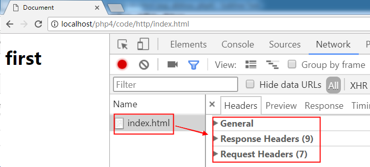
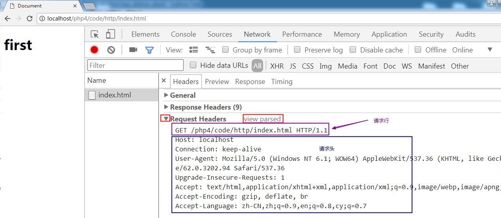
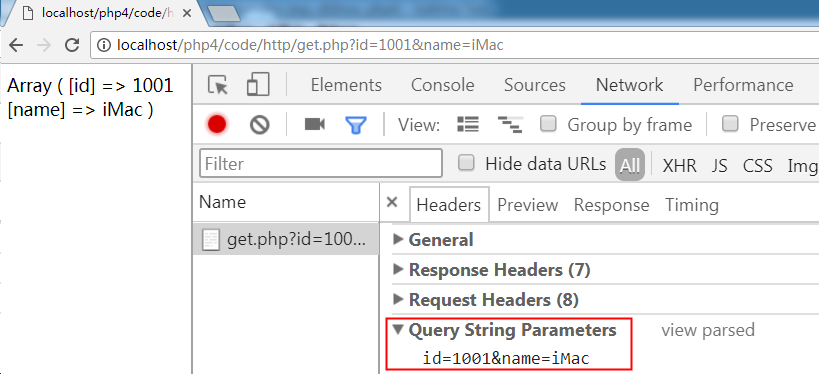
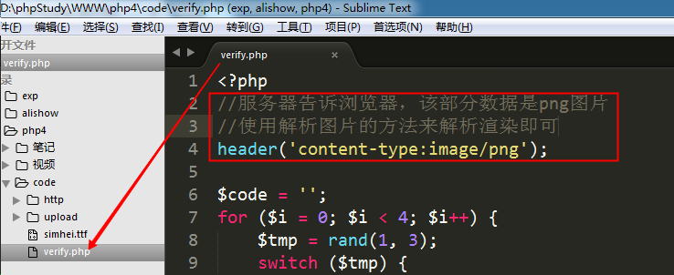
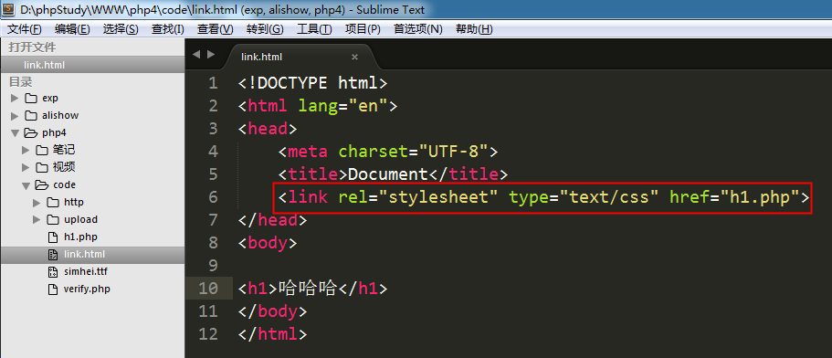
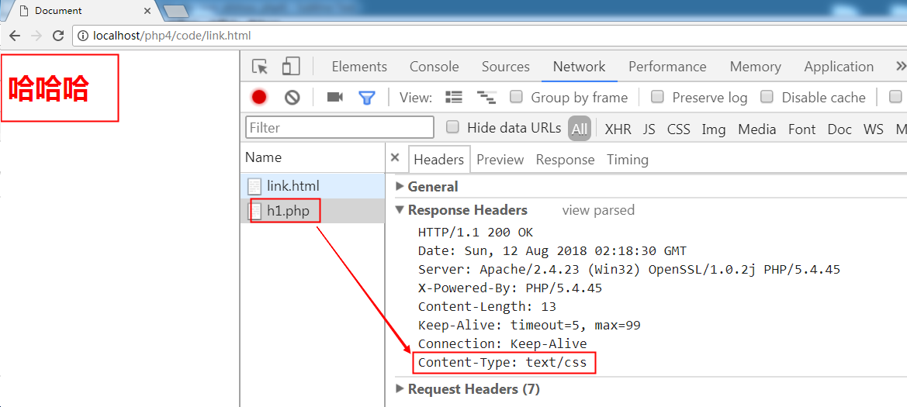
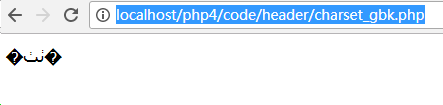
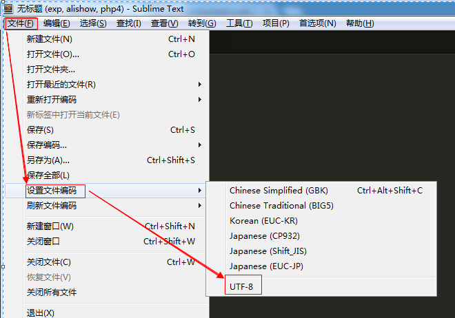
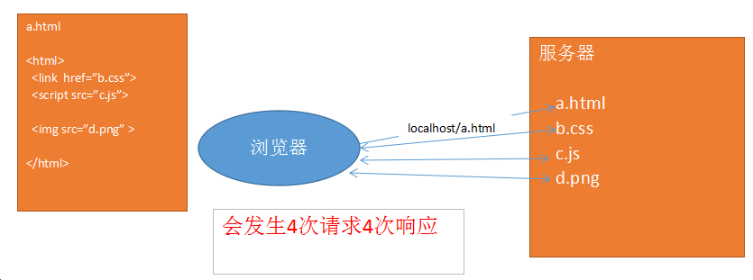

# Http协议

## Http协议概述

协议: 就是事先的一种约定、规则、规范、标准。（租房合同、工作合同）。

    HTTP协议：HyperText Transfer Protocol 超文本传输协议，客户端（浏览器端）与WEB服务器端之间的交互协议。当浏览器和服务器进行数据交换时，html文件、图片、CSS、JS等都是基于HTTP协议进行传输的。

  HTTP协议有两个版本: 1.0 和 1.1，目前使用的基本都是1.1

  特点: 

    通常是基于 B/S 结构软件的。
    无连接: 浏览器向服务器发送一次请求，服务器响应一次，链接即结束。
    无状态: 无记忆。 服务器不能记住哪个浏览器访问过。 

## 无连接 -- 没有持久化链接

    当浏览器地址栏输入 www.baidu.com/index.html，按下回车时。浏览器向服务器发送请求。
    服务器找到index.html文件返回给浏览器之后，本次链接断开。

如果在点击该页面中任何一个链接，则重新建立一次链接。客户端发送请求，服务器响应。之后又断开链接。 

## 请求和响应

HTTP协议主要分为两大部分: 

    请求:  访问服务器的任何一个文件都是一次请求
    响应:  服务器处理请求，将结果返回给浏览器。

## 请求( **request** / http request)(请求报文)

客户端(浏览器)向服务器索要数据时遵循的协议

> 请求分为3个部分:  请求行   请求头   请求主体
> 请求行:  请求方式、请求URL地址、协议版本号

    请求头:  主机域名，客户端(浏览器)的信息等

    请求主体:  发送给服务器的数据，get和post都会通过请求主体将数据发送给服务器

可以使用Chrome tools 或者 firebug 来查看请求和响应的信息（F12）

       

        主要请求项:

	  host： 
    
            主机名和端口号，80端口默认不显示

    accept：          可接受的程序类型
    accept-encoding： 可接受的压缩类型
    accept-language： 可接受的语言类型
    cache-control：   缓存控制

---

案例1:  访问 localhost/php4/code/http/index.html 文件    

通过F12进行查看

点击 index.html就能看到右侧的三个信息

案例2:  index.html表单数据提交到index.php文件

post方式提交的数据叫  FormData，以字符串形式将数据进传递

案例3:  index.html页面中a标签跳转到get.php文件

get传值叫做  Query String Parameters

## 响应( **response** / http response)(响应报文)

	响应也分为3部分: 
  
        响应行   
        响应头   
        响应主体

	响应行: 协议版本号、响应结果

  **状态码**

    响应头: 主要是服务器端的信息
    响应主体: 就是从服务器返回给客户端的数据

   主要响应项：

    content-type： 响应内容类型， 
    content-type:text/html，服务器告诉浏览器，返回的这部分数据是文本类型，使用html方式来解析即可。
    content-length： 响应内容的长度 ，content-length:336, 从服务器返回给浏览器的数据总长度为336字节

---

案例1: 访问 localhost/php4/code/http/index.html 文件时的响应信息

案例2: index.html表单数据提交到index.php文件的响应信息

案例3: index.html页面中a标签跳转到get.php文件的响应信息

## 状态码

常见的状态码如下: 

    200 ok   -----   请求成功

    302 redirect|Found  ----- 重定向

    304 not modified ----- 缓存文件

    403 forbidden   -----  禁止访问 （没有权限访问）

    404 Not Found  -----  未找到页面

    500 internal server error  ----- 服务器内部错误 (可能是服务器本身有问题，或者代码错的太离谱)

## header响应头设置

## 设置响应类型

    浏览器发起请求的方式是多样的，当发起请求后服务端会有对应的内容响应过来，浏览器会根据响应头==Content-Type==来对响应的内容进行解析

    content-type主要的响应类型是  text/html   

其他常见类型 :  text/css   text/javascript   image/png  image/jpeg  image/gif

注意: 
      
      所有的响应类型都是  大范围/小类型， 千万不能写反

---

案例1: php绘制的验证码 verify.php

如果改为 text/html

---

案例2: link标签发送请求 

① 创建html文件，使用link标签引入一个php文件

② 在h1.php文件中，设置响应类型（content-type为css）

访问结果:

## 指定字符集

   中文字符集: utf-8  gb2312  gbk

      header('Content-Type:text/html;charset=utf-8');

      header('Content-Type:text/html;charset=gb2312');

页面乱码问题处理方式：

 页面乱码是因为 **文件编码** 和 **页面指定编码** 不一致，所以解决该问题就是要 **统一文件编码和页面指定编码**

    ① 在页面中设置 header ，编码指定为 utf-8

    ② 将文件的编码格式，指定为utf-8 (使用sublime，将保存格式设置为 utf-8 或者 使用editplus另存为文件时，设置utf-8)

    如果 header设置为 utf-8，则文件编码格式也要设置为 utf-8

    如果 header设置为 gbk，则文件编码格式要设置为 ANSI 

① 在sublime创建charset_utf8.php

访问结果:

② 在windows中直接创建 charset_gbk.php

访问结果:

原因:

    sublime创建的文件是utf-8编码的，和页面中header设置的字符集一致，所以能正常显示。

    windows创建的文件是ANSI编码的, 而页面中header设置的字符集是utf-8，两者不一致，所以乱码了。

解决方案:

    ① windows创建的文件，header要设置为 gb2312或者gbk

    ② 将windows创建的文件，改为utf-8编码

修改文件编码可以使用editplus或者sublime都行

现在我们常用的sublime和vs，创建的都是utf-8编码格式的文件，所以，header要设置为 utf-8

## 页面重定向

     header('location:页面地址');

     header('refresh:2;url=页面地址');

扩展内容:

