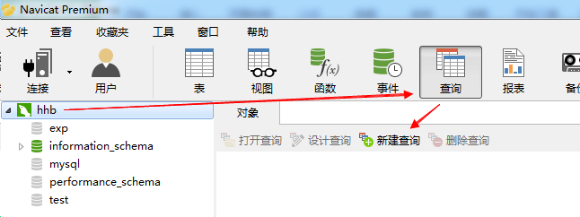
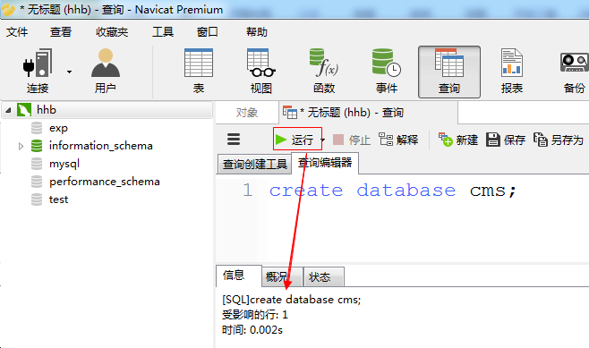

#  创建/删除数据库

操作数据库需要使用SQL语句（结构化查询语言）

1) 创建数据库

 语法格式: create database 库名;

    示例:
            create database study;   创建一个名为 study的数据库

            create database cms:     创建一个名为 cms 的数据库

2) 删除数据库:

  语法格式:  drop database 库名;

  示例:   
    
        drop database school;  删除school库

        drop database cms;      删除cms库

