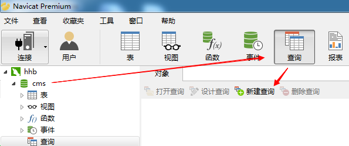
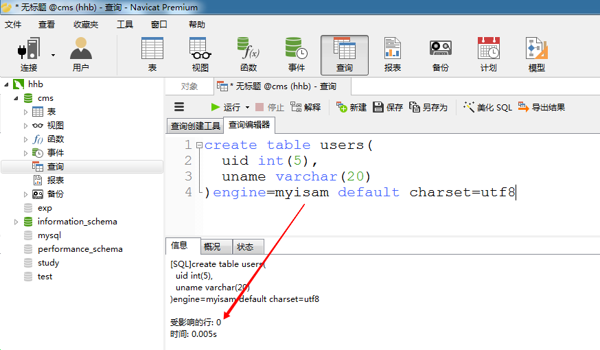

# 创建数据表

## 创建表的基本格式

语句格式:

CREATE TABLE 表名 (

        列名     数据类型(长度)    完整性约束条件,

        列名     数据类型(长度)    完整性约束条件,
        ......
  

) engine=myisam default charset=utf8

 

**注意事项:**

   **列名、数据类型、长度是必有的； 完整性约束条件可以没有**

   **最后的 utf8 没有 -**

## 创建用户表 -- users

---

案例:  在cms数据库中，创建一张users数据表，该表中只保存用户id和用户名两个字段

**一定要先选中 cms 库，再去打开查询编辑器**

uid   int (5) :  uid字段是整型的，长度是5 (0--99999)

uname varchar(20): uname字段是字符串类型，长度是20 
