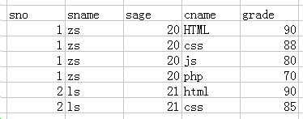
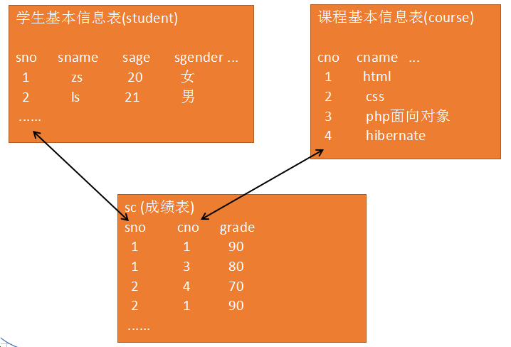

# 1. 关系型数据库

##   1.1 关系型数据库简介

案例: 创建一个数据表，能够保存学生的基本信息(学号、姓名、年龄等)和学生每一科的考试成绩

1)  一张表的形式

 

缺点: 重复数据太多（数据冗余）

 

2) 关系型数据库:




缺点: 表多
优点:
   数据耦合性低
   每个数据表都能够独立管理

##   1.2 student 和 dept表   

 目标: 创建student和dept表用来存储学生的基本信息、学院基本信息和学生所属的学院信息


   student：学生表，所需字段  学号、姓名、性别、年龄、系别

```
create table student(
  sno int UNSIGNED auto_increment primary key,
  sname varchar(20) not null,
  sage tinyint UNSIGNED not null,
  sgender enum('男','女') not null,
  sdept tinyint UNSIGNED not null
)engine=myisam default charset=utf8;
```


   dept：系别表，所需字段  系号  系名

```
create table dept(
  dept_id tinyint UNSIGNED auto_increment primary key,
  dept_name varchar(20) unique not null
)engine=myisam default charset=utf8;
```

##   1.3 ali_admin、ali_cate和ali_article的关系

   目标: 创建 ali_cate表和ali_article表，用来保存栏目基本信息、文章信息 以及 作者、栏目、文章的关系


ali_cate表（栏目表）： 栏目id (主键)、 栏目名、栏目别名、栏目创建时间

```
create table ali_cate(
  cate_id tinyint UNSIGNED auto_increment primary key,
  cate_name varchar(10) unique not null,
  cate_slug varchar(30) UNIQUE not null,
  cate_addtime date not null
)engine=myisam default charset=utf8;
```


ali_article（文章表）： 文章id（主键）、文章标题、文章内容、文章作者、所属栏目、发布时间、文章状态（草稿、已发布）

```
create table ali_article(
  article_id int UNSIGNED auto_increment primary key,
  article_title varchar(30) UNIQUE not null,
  article_content text not null,
  article_adminid int UNSIGNED not null,
	article_cateid tinyint UNSIGNED not null,
  article_addtime int not null,
  article_state enum('草稿','已发布')
)engine=myisam default charset=utf8;
```
