# 2. 数据查询

语法格式: 

  SELECT  字段名1, 字段名2, ......

  FROM 表名	

    ​      [ WHERE <条件表达式> ]

    ​      [ ORDER BY <字段名> [ ASC|DESC ]]

    ​      [ LIMIT  START, LENGTH]

 

##  2.1 基本查询

格式:  select  字段名1, 字段名2,....  from  表名 

> 案例1: 查询所有栏目的id和名称

      表:  ali_cate

      字段:  cate_id、cate_name

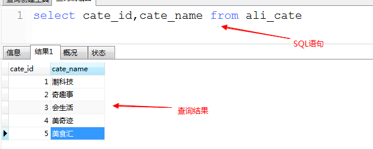

> 案例2: 查询管理员信息 (全部字段信息)

      表: ali_admin

      字段: 所有字段

方式一:  在select和from之间，列出所有字段

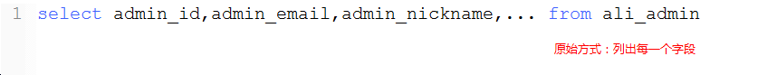

方式二: 使用 * 来代表所有字段

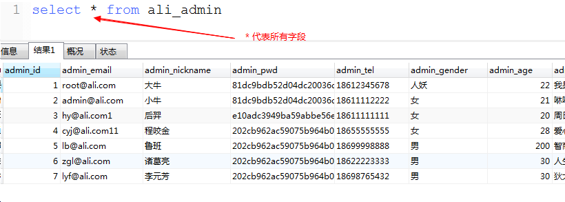

##  2.2 带where子句的查询

select  field1, field2... from 表名  查询表中的所有数据

  where 可以使用条件来筛选查询出的结果

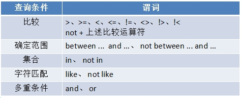 

 

> 案例3: 查询id值为2的栏目的所有信息

      表: ali_cate

      字段:  *

      筛选条件:  cate_id = 2

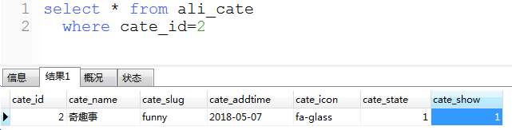

> 案例4: 查询年龄大于等于25的管理员的邮箱和昵称

      表: ali_admin

      字段:  admin_email、 admin_nickname

      筛选条件:  admin_age >= 25

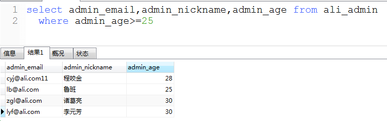

> 案例5: 查询年龄在23-28之间的管理员的所有信息

      表: ali_admin

      字段: *

      筛选条件： admin_age>=23  and  admin_age<=28

方法一:

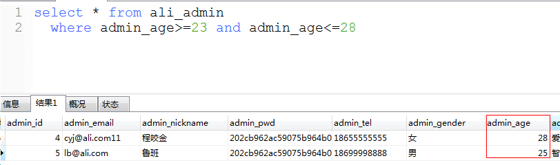

方式二:

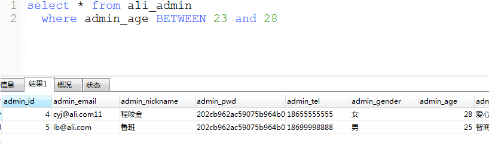

> 案例6: 查询年龄不在23-28之间的管理员的所有信息

      表: ali_admin

      字段: *

      筛选条件： `admin_age<23  or  admin_age>28`

方法一:

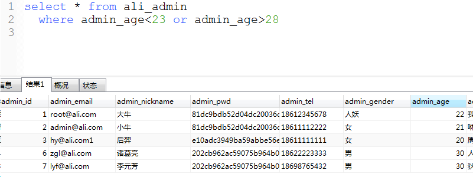

方法二：

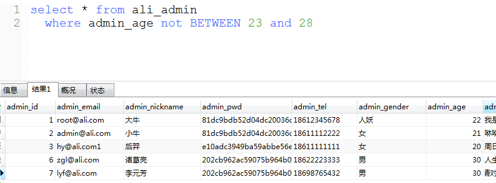

> 案例7: 查询年龄大于25的男性管理员信息

      表: ali_admin

      字段:  *

      筛选条件:  admin_age>=25 and admin_gender='男'

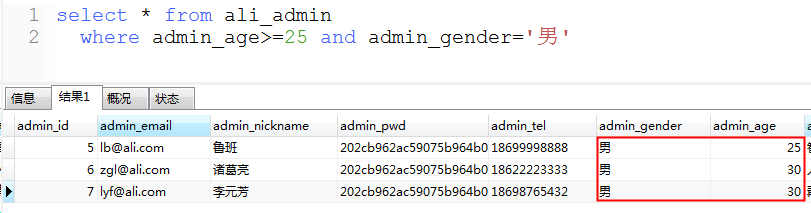

##  2.3 in关键词

集合:  一组相同类型的数据，使用()来包含，括号内使用 ， 分隔开

(1, 2, 3, 4, 5)  (‘潮科技’, ‘会生活’, ‘奇趣事’, ‘美奇迹’)  

 

> 案例8: 查询年龄为20、28的女性管理员信息

      表： ali_admin

      字段： *

      筛选条件： admin_gender='女'  and  （admin_age=20 or admin_age=28）

方式一:

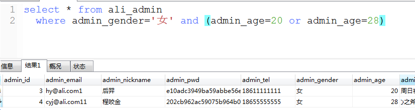

方式二：

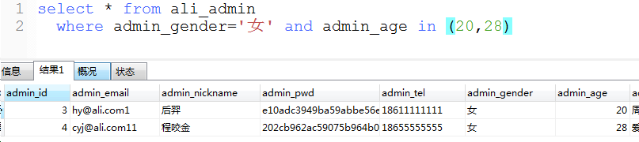

##  2.4 模糊查询

通配符:

  %: 代表任意长度(包括0)的任意字符

  _:  代表1位长度的任意字符

​    a%b :  ab  abb  a对萨达b
    a_b: acb  atb  a的b
    a_b%:  acb  a&baaad

like: 在执行模糊查询时，必须使用like来作为匹配条件

> 案例9: 查询邮箱地址中包含字符h的管理员信息

      表： ali_admin

      字段： *

      筛选条件： admin_email like '%h%'

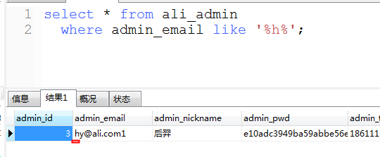

> 案例10: 查询包含“科技”关键词的文章信息

      表： ali_article

      字段： *

      筛选条件：admin_title like ‘%科技%’

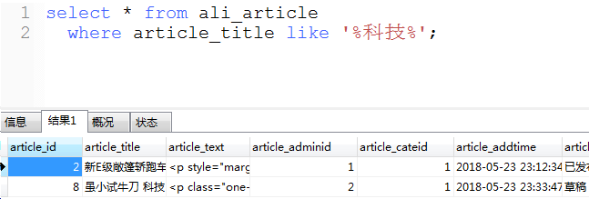

> 案例11: 查询邮箱以a字符开头并且包含n的管理员信息

      表： ali_admin

      字段： *

      筛选条件： admin_email like ‘a%n%’

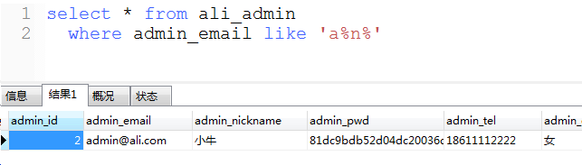

##  2.5 order by 排序

order by 可以对查询结果按某个字段的升降进行排序

  升序 asc （默认值） ，  降序 desc 

可进行排序的字段通常是  整型  英文字符串型  日期型  (中文字符串也行,但一般不用)

> 案例12: 查询所有的栏目信息，并按别名的降序排列

      表： ali_cate

      字段：*

      排序条件： cate_slug  desc

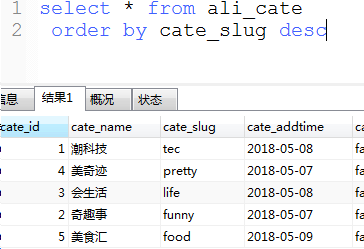

> 案例13: 查询所有栏目信息，并按发布时间升序排列

      表：ali_cate

      字段： *

      排序条件：cate_addtime asc

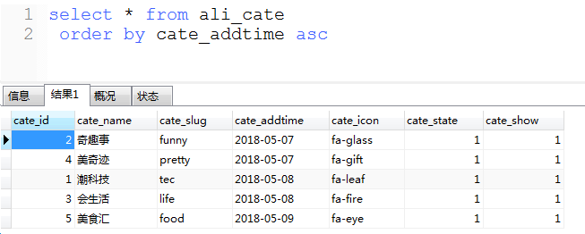

> 案例14: 查询所有男性的管理员信息，并按照创建时间降序排列

      表： ali_admin

      字段：*

      筛选条件： admin_gender='男'

      排序：admin_addtime desc

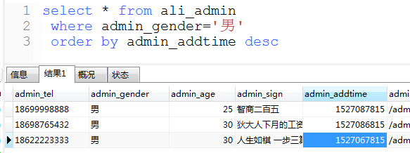

 

##  2.6 limit 限制

limit用来限制查询结果的起始点和长度

 格式:  
 
      limit  var1, var2

 
 var1: 起始点。 查询结果的索引，从0开始。 0代表第一条数据

 var2: 长度

 

> 案例15: 查询年龄最大的3名男性管理员的信息

      表： ali_admin

      字段： *

      筛选： admin_gender='男'

      排序：order by admin_age desc

      限制：limit 0,3

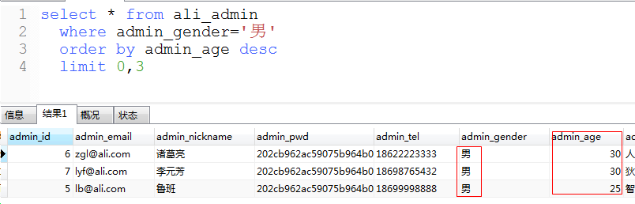

> 案例16: 将文章按发布时间逆序排列，并取出第三条到第五条

    表： ali_article

    字段：*

    排序： article_addtime desc

    限制：limit 2,3

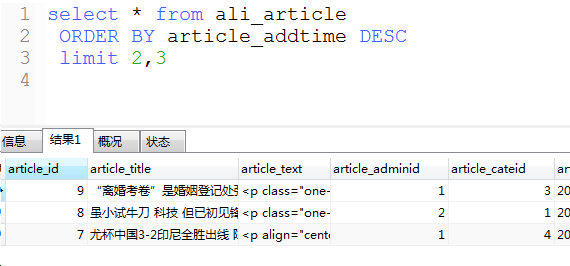

将 *  解释成对应的字段需要 0.0001秒，但是人多了之后就会变慢。

##  2.7 多表查询

关键词: 

      join   on

 

格式:  

    select  *  from  表1

    join 表2  on  链接条件

链接条件一定是   表1的某个字段 =  表2的某个字段

> 案例: 查询学生的全部信息，系别需要使用系名来进行显示

      表： student     dept

      字段: student.*   dept.dept_name

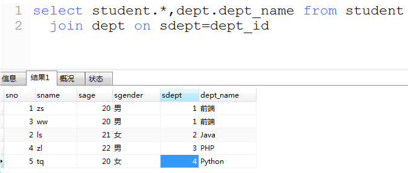

原理:

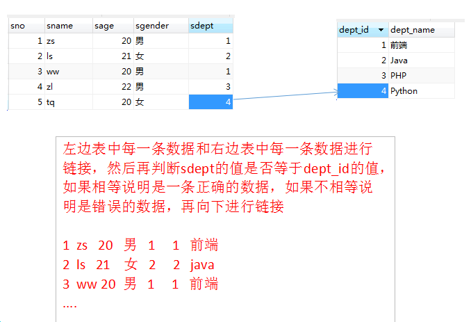

> 案例17: 查询所有文章信息，作者使用昵称显示

表： ali_article   ali_admin

字段： ali_article.*   ali_admin.admin_nickname

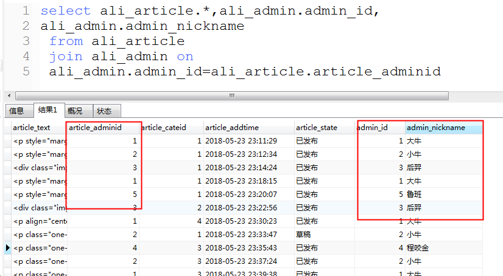

> 案例18: 查询大牛发布的所有文章信息，作者使用昵称显示

表： ali_article   ali_admin

筛选： admin_nickname='大牛'

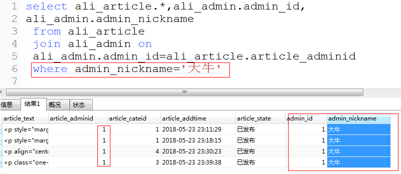

> 案例19: 查询属于潮科技和奇趣事的所有文章

表：ali_cate   ali_article

筛选条件： cate_name in ('潮科技', '奇趣事')

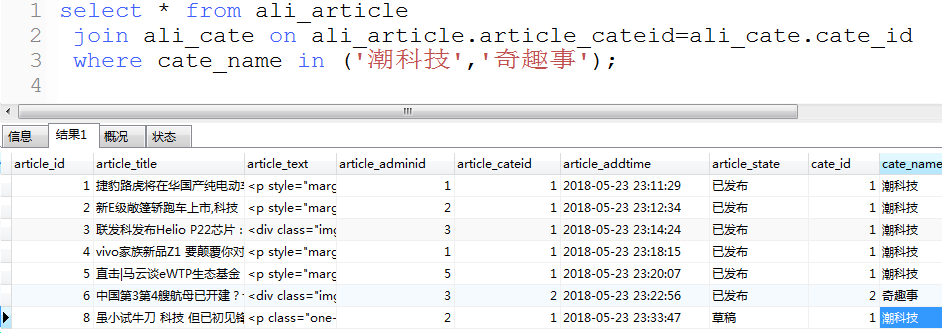

> 案例20: 查询所有文章信息，作者使用昵称显示，栏目使用栏目名显示

表： ali_article    ali_admin   ali_cate

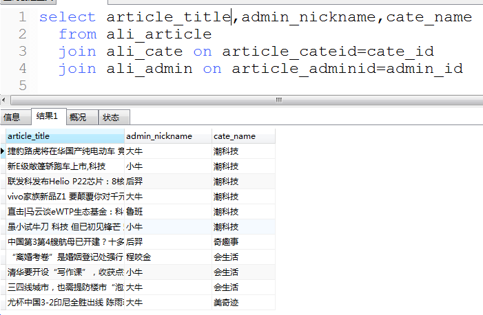

