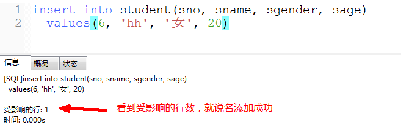
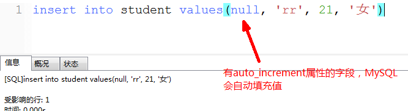

# 3. 添加数据

格式： insert  into  表名(字段1，字段2，...)  values(值1，值2，...);

关键点:

   1) 字段和值需要一一对应，如果不对应会造成添加失败或者数据错误

   2) 如果每个字段都有数据，则不需要在表名后设置字段列表

   3) 带有auto_increment属性的字段可以使用null来设置，MySQL会自动填充数据

> 案例1: 向student表添加一条数据

方式一:

方式二:

方式三: 

