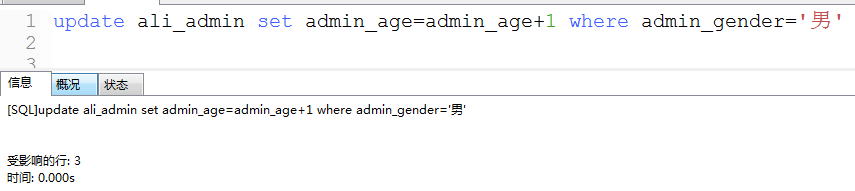

# 4. 修改数据

格式:  

  update  表名   set   字段1=值1, 字段2=值2,...  where  修改条件

  修改表中的哪一条（几条）数据的 字段1=值1...

 

> 案例2: 将id为6的管理员昵称改为凯子

> 案例3: 将所有男性管理员的年龄都+1

表: ali_admin

字段: admin_age

修改条件: admin_gender='男'

