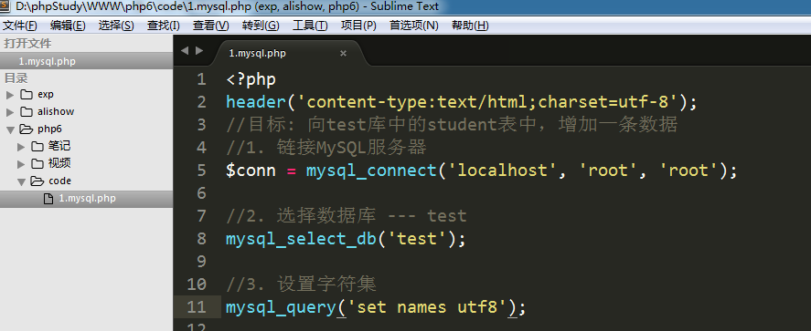
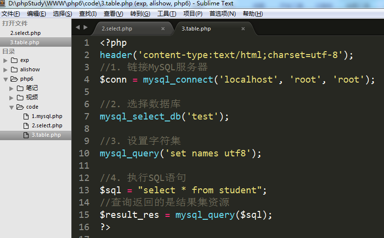
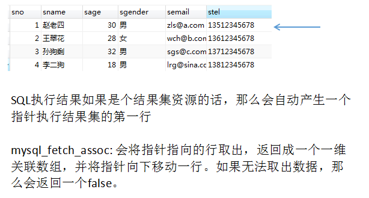

# PHP操作MySQL

PHP当中一共有三组函数可以用来操作MySQL服务器： mysql    mysqli   pdo

   PHP操作数据库是固定流程，一共6步:

   1) 链接MySQL服务器  

   2) 选择要操作的数据库

   3) 设置字符集 （不设置字符集可能会出现乱码问题）

   4) 执行SQL语句

   5) 处理SQL执行结果

   6) 关闭MySQL链接

   除了第五步，其他每一步都是固定的，对应一个mysql的函数

 1) 链接MySQL服务器 --- mysql_connect(var1, var2, var3)

  参数1: MySQL数据库的主机地址

  参数2: MySQL用户名  （root）

  参数3: 用户名对应的密码

  返回值: 数据库链接资源

  `$conn = mysql_connect('localhost', 'root', 'root');`

  2) 选择要操作的数据库  --- mysql_select_db(var)

  参数1: 数据库名称

 `mysql_select_db('demo');`

   3) 设置字符集 --- mysql_query(var);

  参数1: sql 语句 ----  set names utf8  (设置字符集的sql语句)

  `mysql_query('set names utf8');`

   4) 执行SQL语句 --- mysql_query(var);

  参数: sql 语句 ----  增删改查SQL语句

  返回值: 如果是查询，则返回结果集（资源），该资源里面包含了从数据表中取出的数据

            如果是增删改，则返回布尔值，执行成功返回true，失败返回false

  `$result = mysql_query($conn, $sql);`

5) 处理 **查询结果**

 **mysql_fetch_assoc(var);**

  参数: 查询结果集（资源）

  返回值: 一维数组，下标是数据表字段

  将当前行的数据取出并返回成一维数组，同时将指针向下移动一行。

  如果已经无法返回一维数组时，则返回false 

   6) 关闭MySQL链接资源 --- mysql_close(var)

   参数: 数据库链接资源

案例: 向test库中的student表中，增加一条数据

 案例: 查询student表，并将数据以表格形式显示在网页上

 

 

 

 核心: mysql_fetch_assoc的执行原理

 