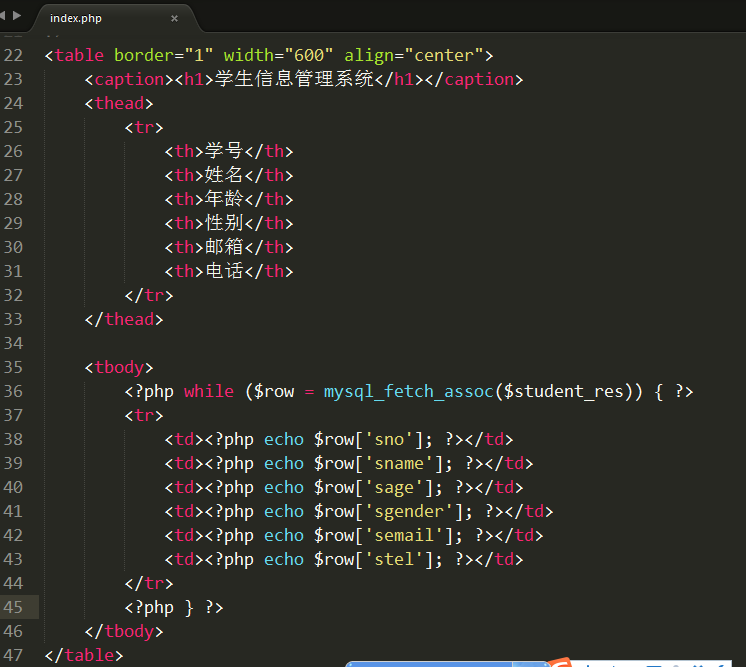
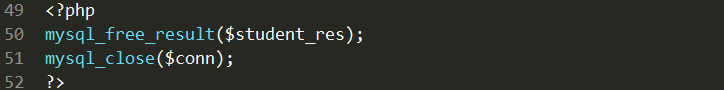
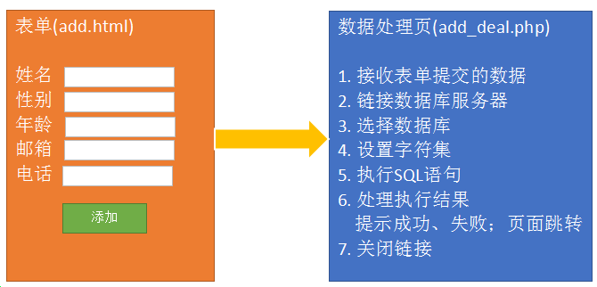
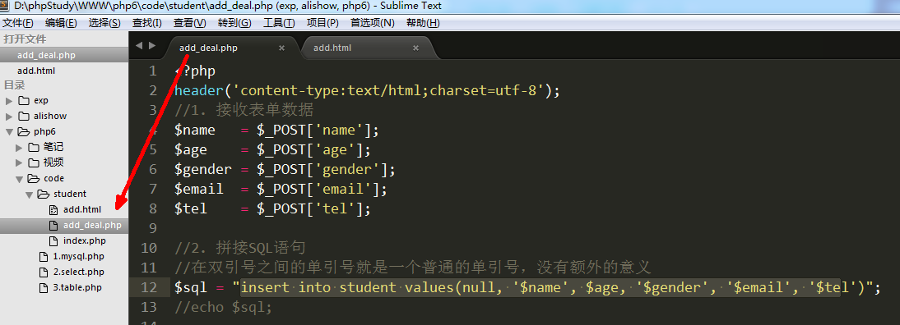
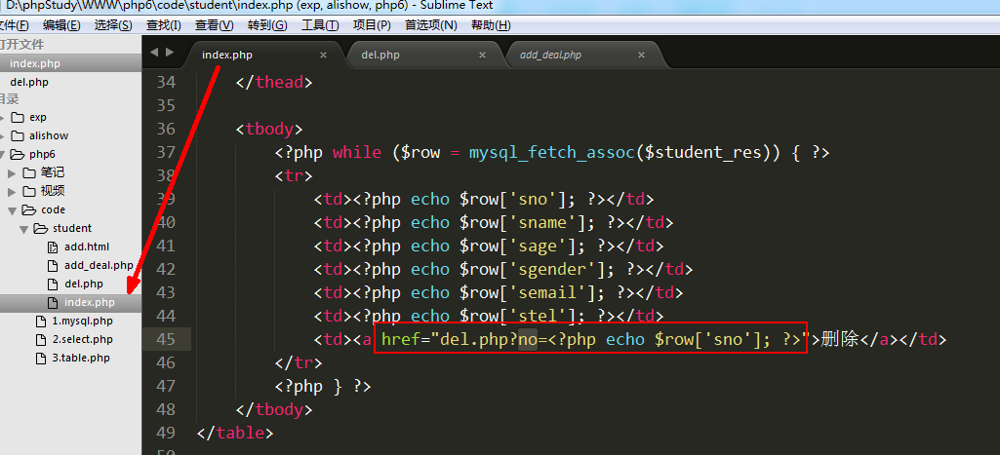
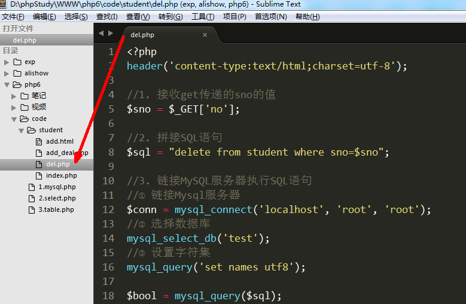
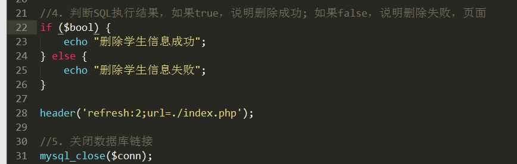

# 学生信息管理系统

**目标: 通过PHP网页来管理数据库，对数据表的数据进行增删改查**

数据表设计:

        sno： 学号  整型  无符号  主键  自增长
        sname： 姓名  字符串
        sage： 年龄 无符号 微整型
        sgender： 性别 枚举
        semail： 邮箱
        stel： 电话

        create table student(
        sno int UNSIGNED auto_increment PRIMARY key,
        sname VARCHAR(30) not null,
        sage tinyint UNSIGNED not null,
        sgender enum('男', '女') DEFAULT '男',
        semail varchar(30),
        stel   char(11)
        ) engine=myisam DEFAULT charset=utf8;

测试数据:

INSERT INTO student VALUES ('1', '赵老四', '30', '男', 'zls@a.com', '13512345678');

INSERT INTO student VALUES ('2', '王翠花', '28', '女', 'wch@b.com', '13612345678');

INSERT INTO student VALUES ('3', '孙狗剩', '32', '男', 'sgs@c.com', '13712345678');

## 学生信息列表

核心SQL:  select  *  from  student

 将student表的数据以表格形式显示在网页上

 1) 从student表中获取数据

 

 2) 将获取的数据显示表格

 

 3) 释放资源

 

 ## 添加学生信息

 核心SQL:  insert into student values(null, '路飞', 10, '男', 'lf@dasd.com', 18012345678);

 

 代码实现:

add.html  ----   提供一个可以填写的表单

add_deal.php

  1) 接收表单数据

  2) 拼接SQL语句

  3) 链接MySQL服务器并执行SQL语句

  4) 处理SQL执行结果： 判断结果，如果是true说明添加成功，如果是false说明添加失败

  5) 关闭数据库链接

## 删除学生

核心SQL:  **delete from student where sno=5**

步骤: 

   1) 在学生信息列表页(index.php)，为每一行都添加一个删除按钮，删除按钮可以跳转到另一个php(del.php)页面，在跳转时，将当前行的sno一起传递到del.php页面。

   2) del.php页面，接收sno，拼接删除的sql语句，再执行该SQL。再根据删除结果提示删除成功/删除失败。跳转回学生列表页。

  ① 接收学号 sno

  ② 拼接删除的SQL语句

  ③ 链接MySQL服务器并执行SQL语句

