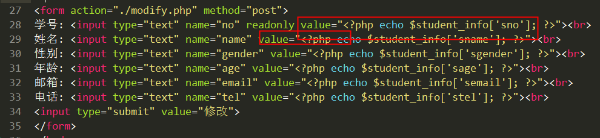

# 修改学生信息

核心：构造一条修改数据的SQL语句   

   **update student set sname='', sage=''..  where sno=6**

步骤:

 1) 在学生列表页(list.php)为每一行都添加一个“编辑”按钮，跳转到编辑表单页(edit.php)，并且要将当前行的sno一起传递到edit.php页面。

 

 2) 创建edit.php页面(和add.html页面结构一样)，接收sno，拼接SQL语句并执行，得到一个一维数组，将该数组的值填充到表单中。

  ① 接收sno

  ② 根据sno 查询学生信息

  ③ 将学生信息显示到表单中  -- 将add.html中的表单复制过来，稍作修改即可

  ④ 保证表单能够提交到modify.php页面即可

3) 创建一个修改页面(modify.php)，接收edit.php页面表单中的值，拼接一个修改的SQL语句，执行该SQL语句。根据修改结果提示修改成功/修改失败，再跳转

 ① 接收表单提交的数据

 ② 编写修改的SQL语句 --- update

 ③ 链接MySQL服务器并执行SQL语句

关于排错: 

     核心思想: 如果一个程序中有SQL语句执行，那么该程序出现错误，第一反应去检查SQL语句。

     检查方法:

          1) 在php页面中使用echo 将sql语句进行输出

           2) 在页面上复制SQL语句到navicat中进行测试

   第一步:

将SQL语句复制到navicat中执行，获取错误信息。

# 登录

验证逻辑:

 1) 根据用户名从ali_admin表中查询数据。如果有结果，则说明用户名正确；反之，说明用户名错误。

 2) 登录表单提交密码和上一步查询出的密码进行比对，两者相等说明密码正确；反之，密码错误。

代码实现:

1) 创建login.html 登录表单页

2)  创建check.php文件

  ① 接收表单提交的数据

  ② 验证用户名是否正确

      核心思路:  根据接收的用户名查询ali_admin表，如果能够查询到数据，说明用户名正确；反之，查询不到数据说明用户名错误。

       核心SQL: ==select * from ali_admin where admin_email='$email'==

       该SQL语句的执行结果，只能是0条数据 或者 1条数据

  ③ 验证密码是否正确

   核心思路:  验证从数据表中查询出的数据中的密码和表单提交的密码是否一致。如果一致，则说明密码正确，可以正常登录；反之，说明密码错误，跳转到login.html页面

测试: 直接访问 list.php页面，依然可以看到页面结果。 因为http协议是无记忆协议，不知道哪个浏览器来过，所以没办法限制是否能够正常访问到哪个页面。

要实现限制的功能，必须配合 **会话控制**技术

# 登录

验证逻辑:

 1) 根据用户名从ali_admin表中查询数据。如果有结果，则说明用户名正确；反之，说明用户名错误。

 2) 登录表单提交密码和上一步查询出的密码进行比对，两者相等说明密码正确；反之，密码错误。

代码实现:

1) 创建login.html 登录表单页

2)  创建check.php文件

  ① 接收表单提交的数据

  ② 验证用户名是否正确

      核心思路:  根据接收的用户名查询ali_admin表，如果能够查询到数据，说明用户名正确；反之，查询不到数据说明用户名错误。

       核心SQL: ==select * from ali_admin where admin_email='$email'==

       该SQL语句的执行结果，只能是0条数据 或者 1条数据

  ③ 验证密码是否正确

   核心思路:  验证从数据表中查询出的数据中的密码和表单提交的密码是否一致。如果一致，则说明密码正确，可以正常登录；反之，说明密码错误，跳转到login.html页面

测试: 直接访问 list.php页面，依然可以看到页面结果。 因为http协议是无记忆协议，不知道哪个浏览器来过，所以没办法限制是否能够正常访问到哪个页面。

要实现限制的功能，必须配合 **会话控制**技术
