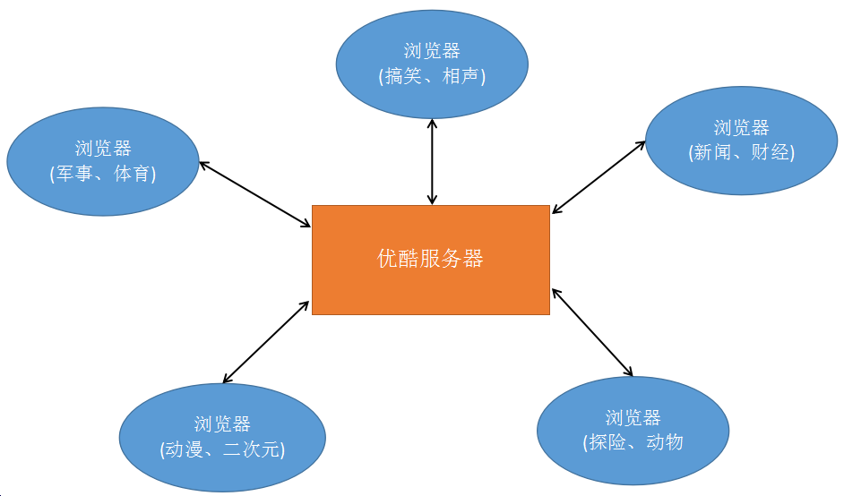
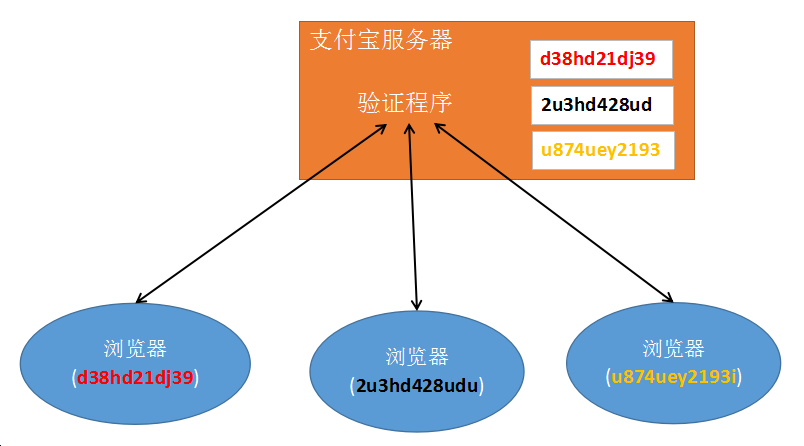

# 会话控制概述

1) http协议的缺陷

     无状态，就是无记忆，不能让同一浏览器和服务器进行多次数据交换时，产生业务的连续性。

2) 什么是会话控制

     会话控制就是解决http无记忆的缺陷的。能够==将数据持久化的保存在客户端(浏览器)或者服务器端==，从而让浏览器和服务器进行多次数据交换时，产生连续性。

3) 会话控制的分类

    分为两种: cookie（客户端）  和  session（服务器端）

cookie应用实例 --- 千人千面（猜你喜欢）

不同的用户访问优酷服务器所看的视频类型不一样。 服务器会将浏览器观看过的视频的关键词保存到浏览器的cookie中（文件、内存）。当浏览器再次访问优酷服务器时，服务器会从cookie中读取关键词，再根据关键词推荐视频。

session应用实例 --- 支付宝

每个用户访问支付宝进行登录时，用的是同一套程序。服务器会为每一个浏览器进行编号(sessionid)，当用户登录成功后，服务器会创建一个区域(文件、内存服务器)用来保存用户信息。等浏览器下一次访问服务器时，服务器先拿到浏览器的编号，再和已有的编号进行比较，找到相同的区域（文件、内存服务器）。