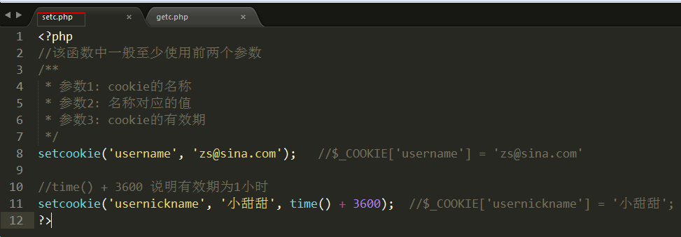
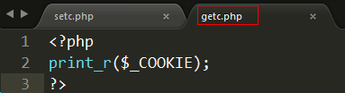
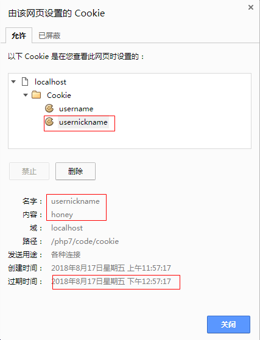
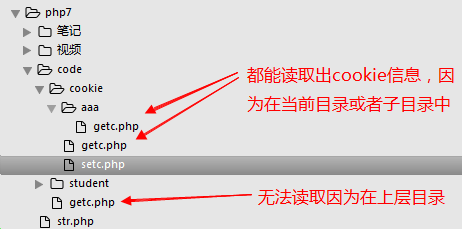
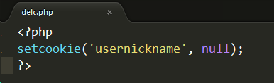
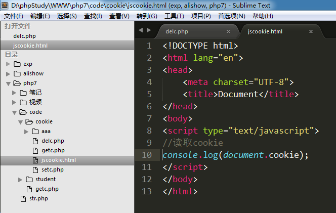

# cookie技术

## 什么是cookie？

  cookie是将数据持久化存储到客户端的一种技术。

   网站可以将数据写到浏览器中， 一个网站最多能在一个浏览器写20个cookie。

   一个浏览器能够设置的总cookie数最多为300个，每个不能超过4kb。

   cookie既能保存在文件中，也能保存在内存中。

## 设置/读取cookie

1) 设置cookie

   setcookie(var1 , var2, var3);

   var1: cookie的名称

   var2: 名称对应的值， 可选参数

   var3: cookie的有效期， 可选参数

   

2) 读取cookie信息

   使用php的超全局变量 $_COOKIE进行读取

   

   通过浏览器查看cookie信息:

   

   

## cookie有效期

  setcookie函数的参数3可以控制cookie有效期

        参数3设置为-1 或者 不设置，关闭浏览器即失效
        参数3设置为 time()+秒数，则在当前时间点的多少秒之后失效

  设置cookie时，如果设置了有效期，则cookie会保存在文件中；如果没有设置有效期，则cookie保存在内存中。

  ## cookie的有效范围

  **setcookie函数还有参数4、5，可以用来控制cookie的有效访问，但是一般不用。**

只需要记住下面的情况即可：   

        在不使用参数4和5的情况下，cookie在当前目录及子目录中有效，在上层目录中无效。

## cookie删除

 setcookie函数第二个参数设置为null，就可以删除cookie

        setcookie('name', null);

 ## js控制cookie

 cookie是将数据保存在客户端的，所以可以使用javascript来读取/设置cookie。 

   设置cookie:   document.cookie = “名称=值;expires=时间”

   读取cookie:   document.cookie

读取cookie:

设置cookie:

  expires: 用来指定cookie有效期的

