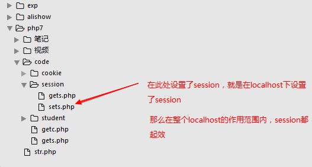

# session技术

##  session介绍

因为cookie是保存在客户端的数据，不够安全，所以出现了session。

session会将数据保存到服务器端（保存在 **文件**、内存服务器或数据表中），安全性就可以得到保证。

## 设置/读取session

重点:

    php使用session时，首先要使用session_start()函数来开启session。
    $_SESSION 超全局变量就能设置和读取session中的内容

1) 设置session

   将session作为数组操作就可以。

2) 读取session

## session作用范围

   在当前网站的任何一个页面设置过session，则该网站的所有页面都能得到该session的数据

   例如: 在 www.jd.com 的某个页面中设置session，那么在jd网站的任何一个页面都能找到该session

   同理，在localhost的某个页面中设置session，那么在localhost的任何一个php页面都能找到

## session的有效期

    浏览器关闭时，session消失

## 删除session

 unset($_SESSION[‘name’]);    //删除单个session

   session_destroy();                   //删除所有session

